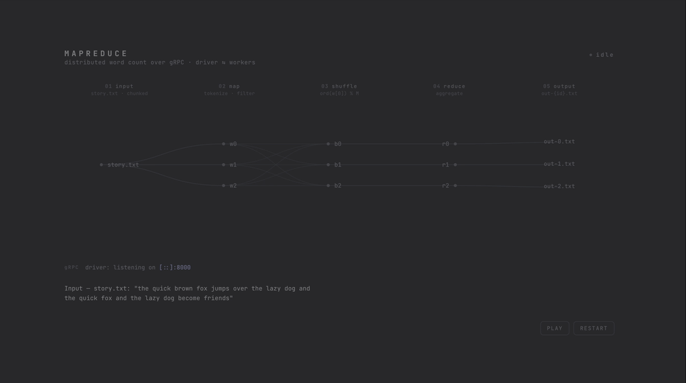

# Distributed MapReduce over gRPC

A small distributed MapReduce that counts words across text files.
A single driver coordinates a pool of workers over gRPC: the driver hands out map and reduce tasks, and the workers execute them.



> The animation is generated from [`docs/visualization.html`](docs/visualization.html); open that file in a browser for the interactive version.
> It illustrates a single file split into chunks.

## Requirements

- Python 3.12+.
- [uv](https://docs.astral.sh/uv/) for environment and dependency management.

## Setup

```shell
uv sync
```

This also installs the project itself, which exposes the `mapreduce-driver` and `mapreduce-worker` commands.

## Running

Run the example on the text files in `data/`.
Open one terminal for the driver and one terminal per worker.

Start the driver:

```shell
uv run mapreduce-driver -N 12 -M 8 -nw 4 -dir ./data
```

- `-N`: number of MAP tasks (default: 4).
- `-M`: number of REDUCE tasks (default: 6).
- `-nw`: maximum number of worker threads the gRPC driver server uses to handle requests concurrently (default: 4).
- `-dir`: directory containing the input `.txt` files (default: `./data`).
- `--address`: address the driver binds to (default: `[::]:8000`).
- `--profile`: enable the profiler (default: off).

Start each worker in its own terminal:

```shell
uv run mapreduce-worker
```

- `--name`: worker name, used to label its profiling output (required when `--profile` is set).
- `--address`: address of the driver to connect to.
  Defaults to the `MAPREDUCE_ADDRESS` environment variable, or `localhost:8000` if that is unset.
- `--profile`: enable the profiler (default: off).

To run the driver and workers on a non-default port, point them at the same address:

```shell
uv run mapreduce-driver --address "[::]:9000"
uv run mapreduce-worker --address localhost:9000
```

Alternatively, set the `MAPREDUCE_ADDRESS` environment variable so every worker picks it up without passing `--address`:

```shell
export MAPREDUCE_ADDRESS=localhost:9000
uv run mapreduce-worker
```

Outputs:

- Final output is written to `./out`, one file per reduce task, each containing word-count pairs separated by whitespace.
- Intermediate map output is written to `./tmp`.
  Each intermediate file holds the words whose bucket is `bucket_id = ord(first_character_of_word) % M`.

## Testing

```shell
uv run pytest
```

The suite has unit tests (tokenizing, filtering, file assignment, bucketing, reducing, and the driver state machine).
It also has one end-to-end test that runs the real driver and workers as subprocesses and compares the result against a naive single-process word count.

## Regenerating the protobuf stubs

The generated stubs (`src/mapreduce/map_reduce_pb2*.py`) are committed to the repository.
Regenerate them after editing `src/mapreduce/map_reduce.proto`:

```shell
uv run python scripts/generate_protos.py
```

## How it works

- On startup, each worker waits for the driver and asks it for a task (map, reduce, or wait).
- A worker that finishes its map tasks waits until all other in-flight map tasks are done before the reduce phase starts.
- When all tasks are done, the driver shuts down and the workers exit.
- Words are normalized by lowercasing the text and keeping only words whose characters are all in `a-z`.
- Map tasks are assigned to input files with a round-robin strategy: the first task gets the first file, the second task the second file, and so on, wrapping around until every file is assigned.

## Limitations

- A map task processes an entire input file.
  The implementation could be extended to process chunks of a file per map task.
- Very large files are not handled well.
  A single large file forces one worker to run much longer than the others while they sit idle.
  Splitting files into roughly equal chunks on word boundaries (for example `min(chunksize, position_of_last_blank)`) would balance the work.
